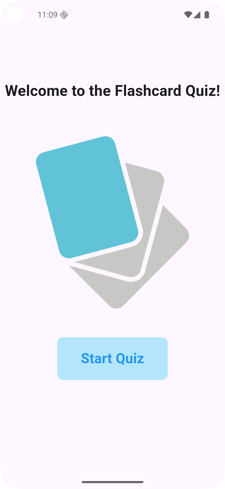
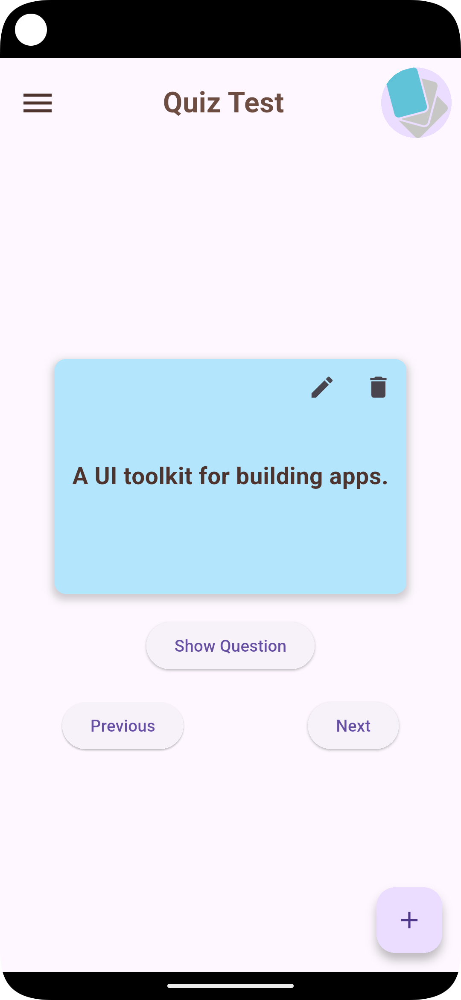
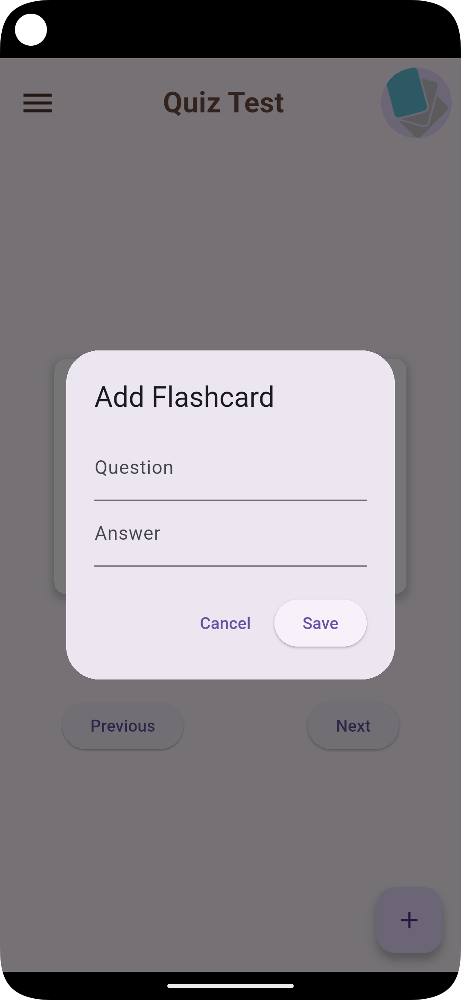
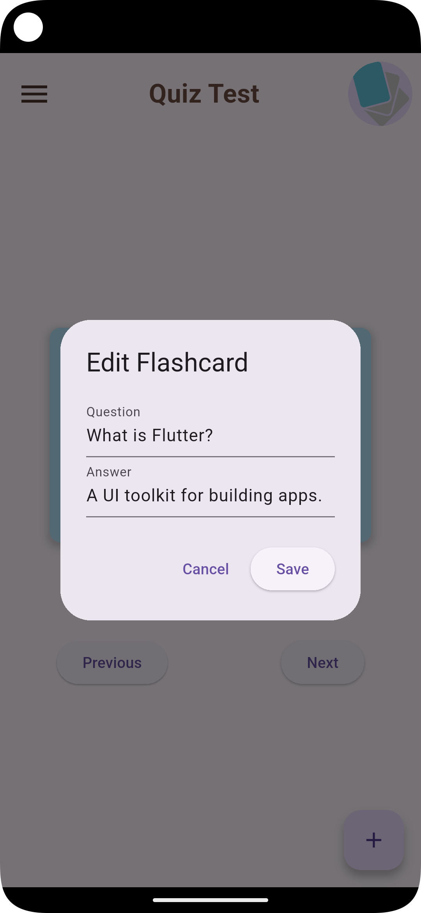

# 📚 Flutter Flashcard Quiz App

>A simple and interactive **flashcard-based quiz app** built using Flutter. Designed to help users learn efficiently by flipping flashcards with questions and answers. Customize your own flashcards and navigate through them easily.

---

## ✨ Features

- ✅ View flashcards with **question-answer** toggle
- ✅ Navigate between cards using **Next** and **Previous** buttons
- ✅ Add new flashcards
- ✅ Edit existing flashcards
- ✅ Delete flashcards
- ✅ Clean, modern interface with responsive design

---

## 🖼️ Screenshots

| Intro Screen              | Home Screen              | Answer Flashcard        |
|---------------------------|--------------------------|-------------------------|
|  |  |  |

| Add Flashcard           | Edit Flashcard           |
|-------------------------|--------------------------|
|  |  |
